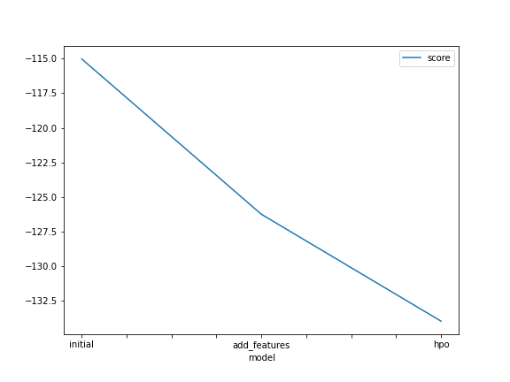
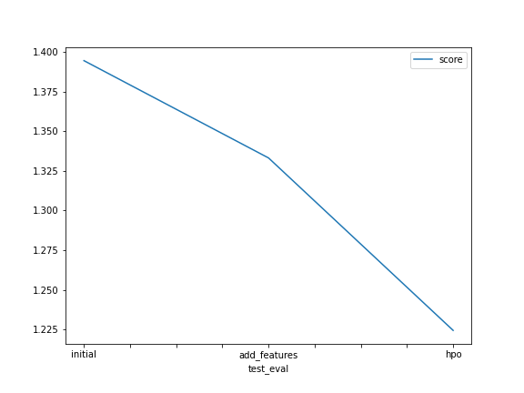

# Report: Predict Bike Sharing Demand with AutoGluon Solution
#### Chiara Parrillo

## Initial Training
### What did you realize when you tried to submit your predictions? What changes were needed to the output of the predictor to submit your results?
In the beginning I realized that there were problems with the evaluate function. In particular, test.csv didn't have the ground truth values, so I used submission count column to make it work. After that I found that all the parameters were nwgative, so I set them all 0 and then I submitted the resulted dataframe.

### What was the top ranked model that performed?
The second model was the top ranking one.

## Exploratory data analysis and feature creation
### What did the exploratory analysis find and how did you add additional features?

Using describe method and hist method, I observed features characteristics. Histograms in particular gave me a better idea of the data distribution. 

The first thing I can observe was that datetime column could be divided in three subfeatures: "year", "month" and "day".

As well, observing the other features, "season" and "weather" represented categorical data distribution with distinct values, so I mapped them to categorical dtype. 

### How much better did your model preform after adding additional features and why do you think that is?
Model performed better after adding the three additional features. RMSE score reduced from 1.39440 to 1.33311.

## Hyper parameter tuning
### How much better did your model preform after trying different hyper parameters?
Second and third models performed slightly the same. The third one degraded a little. RMSE kaggle score increased from 1.33311 to 1.22447.

### If you were given more time with this dataset, where do you think you would spend more time?
I'd spend more time studying data distributions. Also I'd study autoGluon models, trying to apply them to data to see the main differences and to understand which model could be the best one for this type of datasets.

I'd also like to try some more hyperparameters' values trying to decrease RMSE.

### Create a table with the models you ran, the hyperparameters modified, and the kaggle score.
|model|time_limit|num_boost_round|num_epochs|score|
|--|--|--|--|--|
|initial|600|default|default|1.39440|
|add_features|600|default|default|1.33528|
|hpo|1000|150|default|1.22447|

### Create a line plot showing the top model score for the three (or more) training runs during the project.

### Create a line plot showing the top kaggle score for the three (or more) prediction submissions during the project.

## Summary
In this study I build a regression model to predict the bike demand, given the bike sharing historical data. 
Firstly, I analyzed the features, using mainly pandas methods. After that, I've built an initial first model with default parameters and obtained the initial RMSE score after training the model. This was initial benchmark established.

The second step of this study was to analyze data pattern in features. That was done using hystogram graphics. Based on this visual inspection, I decided to add new features, extracting three new features from "datetype" column and to change dtype from numeric to categorical. Then I trained a new model that has shown an improved of RMSE Kaggle score on test data.

Lastly, I decided to use a specific hyperparameter for model algorithm: GBM (tree based model) with different hyperparameter settings. After the training,  the model show a slight increase in RMSE score from 1.33528 to 1.22447.

In the end, I compared the Kaggle score of all model and plotted these scores against hyperparameter settings to analyze the relative improvement or degradation in performance.

Comparing the results, I think that addictional improvement can be done, switching between more hyperparametes algorithms and settings.
